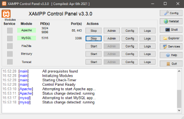

# Sistema de Gerenciamento de Login e Cadastro - PHP

Este é um sistema simples de gerenciamento de login e cadastro desenvolvido em PHP, com uso do MySQL Workbench e XAMPP. Ele permite que os usuários façam login, cadastrem-se, redefinam suas senhas e acessem um painel após o login bem-sucedido.

## Funcionalidades Principais

### 1. Login

O formulário de login permite que os usuários autentiquem-se no sistema fornecendo seu e-mail e senha. Se as credenciais estiverem corretas, o usuário é redirecionado para o painel de controle.

  

### 2. Cadastro de Usuário

Os usuários podem se cadastrar fornecendo seu nome, e-mail, telefone, data de nascimento, senha e gênero. Após o cadastro bem-sucedido, eles podem fazer login no sistema.

  

### 3. Recuperação de Senha

O sistema permite que os usuários recuperem suas senhas em caso de esquecimento. Eles precisam fornecer seu e-mail, data de nascimento e telefone para receber um link para redefinir sua senha.

  

### 4. Redefinição de Senha

Após solicitar a recuperação de senha, os usuários recebem um link para definir uma nova senha. Eles precisam fornecer a nova senha e confirmá-la para concluir o processo.

  

### 5. Painel de Controle

Após fazer login com sucesso, os usuários são redirecionados para um painel de controle onde podem acessar recursos adicionais do sistema.

## Estrutura do Código

O código está dividido em diferentes arquivos PHP, cada um responsável por uma parte específica da aplicação:

- **login.php**: Formulário de login para autenticação de usuários.
- **cadastro.php**: Formulário de cadastro para novos usuários.
- **painel_logado.php**: Página de destino após o login bem-sucedido.

Caso o usuario esqueça sua senha, ele podera alterala:
- **recuperar_senha.php**: Formulário para recuperação de senha por e-mail, data de nascimento e telefone.
- **nova_senha.php**: Formulário para definir uma nova senha após a recuperação.
## Como Executar

Para executar o sistema, siga estas etapas:

1. Certifique-se de ter o XAMPP instalado em sua máquina. Você pode baixá-lo em https://www.apachefriends.org/pt_br/index.html.

  

2. Clone este repositório para o diretório `htdocs` dentro do diretório de instalação do XAMPP.
3. Inicie os serviços Apache e MySQL através do painel de controle do XAMPP.
4. Importe o arquivo SQL fornecido pelo MySQL Workbench para criar o banco de dados necessário.
5. Acesse o sistema através do seu navegador web digitando `http://localhost/nome_do_diretorio_do_projeto` na barra de endereço.

## Tecnologias Utilizadas

- **PHP**: Linguagem de programação utilizada para desenvolver o backend do sistema.
- **MySQL**: Banco de dados utilizado para armazenar informações dos usuários, com modelagem e administração realizadas pelo MySQL Workbench.
- **XAMPP**: Pacote de software gratuito que contém o Apache, MySQL, PHP e Perl. Utilizado como ambiente de desenvolvimento local.
- **HTML e CSS**: Utilizados para a construção da interface do usuário.

---

Este projeto é uma demonstração de um sistema de login e cadastro em PHP, desenvolvido com uso do MySQL Workbench e XAMPP. Sinta-se à vontade para explorar, modificar e utilizar!!!!

## Contato

- Autor: Queriate Silva

- [GitHub](https://github.com/Queriate)
- [LinkedIn](https://www.linkedin.com/in/queriate-silva/)
- Email: queriatejobs@gmail.com

---
